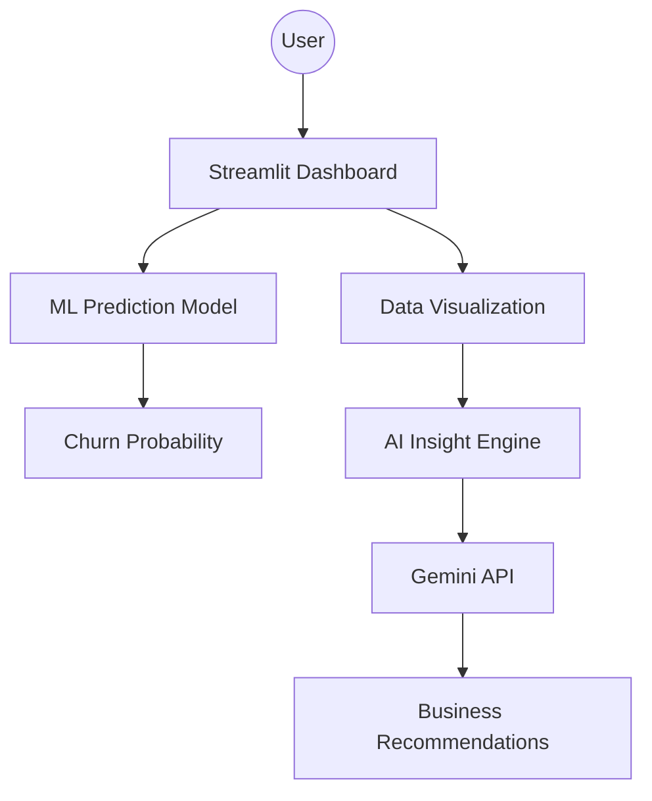

# AI-Powered Customer Retention & Churn Analysis Dashboard

An end-to-end AI analytics solution designed to analyze telecom customer behavior, predict churn probability, and generate automated business strategies using Generative AI.

## 🚀 Project Overview

Customer churn is a critical challenge in the telecom industry, directly impacting recurring revenue. This project addresses this by combining **Machine Learning**, **Interactive Data Visualization**, and **Generative AI** to provide a 360-degree view of customer retention.

**Key Objectives:**

* Identify high-risk customers before they leave.
* Understand the underlying drivers behind customer attrition.
* Provide actionable, AI-driven retention strategies.

---

## 🏗️ System Architecture



### Project Workflow

1. **Data Ingestion:** Loading the Telecom Customer dataset.
2. **Preprocessing:** Data cleaning and Feature Engineering.
3. **Modeling:** Training a Classification Model (e.g., Random Forest) to predict churn.
4. **Deployment:** Integrating the saved model (`.pkl`) into a Streamlit interface.
5. **AI Integration:** Utilizing the Gemini API to interpret data trends and suggest improvements.

---

## 📊 Dataset & Features

The system utilizes telecom customer data covering demographics, account information, and service usage.

| Feature | Description |
| --- | --- |
| **Tenure** | Number of months the customer has stayed with the company |
| **MonthlyCharges** | The amount charged to the customer monthly |
| **TotalCharges** | The total amount charged to the customer |
| **Contract** | The contract term (Month-to-month, One year, Two year) |
| **Churn (Target)** | Whether the customer stayed or left (**Yes/No**) |

---

## ✨ Key Features

### 1. Customer Analytics Dashboard

Interactive visualizations powered by Plotly/Seaborn to explore:

* Churn distribution across different contract types.
* Correlation between Monthly Charges and Retention.
* Tenure-based cohorts.

### 2. ML Churn Prediction

A dedicated interface where users can input customer parameters to receive an instant churn probability score.

* **Input:** Tenure, Contract Type, Charges, etc.
* **Output:** Predictive classification (Likely to Churn / Likely to Stay).

### 3. AI-Generated Business Insights

Integrated with the **Gemini API** to transform raw data into narrative insights.

* Identifies hidden patterns in high-risk segments.
* Suggests specific retention maneuvers (e.g., "Transition month-to-month users to annual plans").

---

## 📁 Project Structure

```text
customer-churn-project
│
├── app.py                # Main Streamlit application
├── data/
│   └── telco_churn.csv   # Raw dataset
├── models/
│   └── churn_model.pkl   # Trained Machine Learning model
├── .env                  # API Key configuration (ignored by git)
├── requirements.txt      # Project dependencies
└── README.md             # Project documentation

```

---

## 🛠️ Installation & Setup

**1. Clone the Repository**

```bash
git clone https://github.com/vishvashah07/customer-churn-project.git
cd customer-churn-project

```

**2. Install Dependencies**

```bash
pip install -r requirements.txt

```

**3. Configure Gemini API**

* Obtain an API key from [Google AI Studio](https://aistudio.google.com/app/apikey).
* Create a `.env` file in the root directory:
```text
GEMINI_API_KEY=your_api_key_here

```


**4. Run the Application**

```bash
streamlit run app.py

```

---

## 🔮 Future Roadmap

* **Cloud Deployment:** Hosting the dashboard on AWS or Streamlit Cloud.
* **Real-time API:** Creating a FastAPI endpoint for external model consumption.
* **Deep Learning:** Implementing Neural Networks for improved accuracy on larger datasets.
* **Automated Retraining:** Setting up a pipeline to update the model as new data arrives.

---

**Author:** [Vishva Shah](https://github.com/vishvashah07)

**Focus:** Information Technology & Data Science

Would you like me to help you draft the `requirements.txt` file or write the Python logic for the Gemini API integration?
